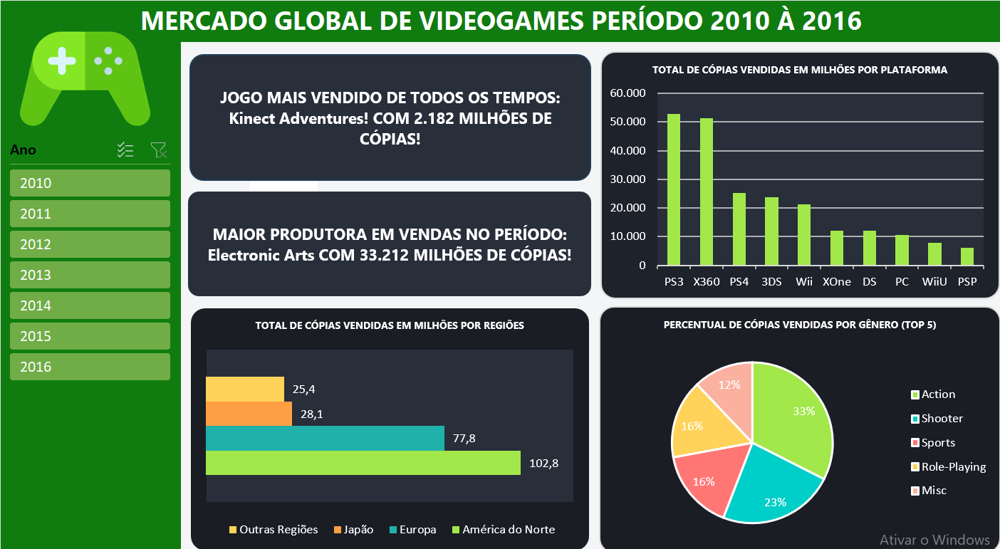

# 🎮 Dashboard de Análise do Mercado Global de Videogames (2010 - 2016)

## 📌 Sobre o Projeto
Este projeto foi desenvolvido como solução para o desafio de Business Intelligence/Excel da **DIO (Digital Innovation One)**. Diferenciando-me da proposta padrão do instrutor, utilizei uma base de dados real extraída do **Kaggle** (Video Game Sales por Gregory Smith), contendo o histórico de vendas de mídias físicas de jogos eletrônicos. 

O objetivo foi transformar dados brutos em um relatório gerencial executivo, permitindo analisar o desempenho de consoles, preferências de gêneros e comportamento regional de consumo.

---

## 🖥️ O Dashboard

---

## 📊 Arquitetura e Modelagem dos Dados
Seguindo as melhores práticas de governança e performance corporativa, o projeto foi estruturado em 4 camadas de planilhas independentes:
1. **Database:** Dados brutos originais tratados via Power Query (UTF-8, tipagem de colunas corrigida e remoção de registros nulos).
2. **Cálculos:** Bastidores do projeto contendo as tabelas dinâmicas independentes e fórmulas matriciais de busca.
3. **Assets:** Guia de estilo contendo a paleta de cores oficial das marcas (RGB/HEX) e ícones utilizados.
4. **Dashboard:** Interface visual final interativa entregue ao usuário.

---

## 💡 Insights de Negócio Gerados

* **Dominância de Gênero:** Os gêneros de **Ação (33%)** e **Tiro/Shooter (23%)** dominam mais da metade de todo o volume de mercado no período, indicando onde distribuidoras devem focar seus investimentos de estoque e marketing.
* **Geomarketing:** A **América do Norte** lidera isoladamente o consumo global (102,8 milhões de cópias), seguida de perto pela Europa. O mercado Japonês se mostra altamente nichado, com preferências distintas das regiões ocidentais.
* **Guerra de Consoles (Sétima Geração):** No período analisado, o **PS3** (52,8M) e o **Xbox 360** (51,2M) travaram uma disputa acirrada e praticamente empatada pelo topo do Market Share de consoles de mesa.
* **Limitação de Base (Senso Crítico):** Identificou-se que os dados do ano de 2016 estão incompletos no dataset original devido ao período em que a raspagem de dados foi realizada, justificando a queda acentuada nos gráficos do último ano.

---

## 🛠️ Tecnologias Utilizadas
* **Excel (Versão Otimizada .xlsx)**
* **Power Query** (Extração, Limpeza e Transformação)
* **Tabelas Dinâmicas & Segmentação de Dados**
* **Fórmulas Utilizadas:** `PROCX` combinada com `MÁX` para cartões dinâmicos.

---

## 🧑‍💻 Autor
* **LUIZ SUTO**
* www.linkedin.com/in/luiz-suto-7a212b434
